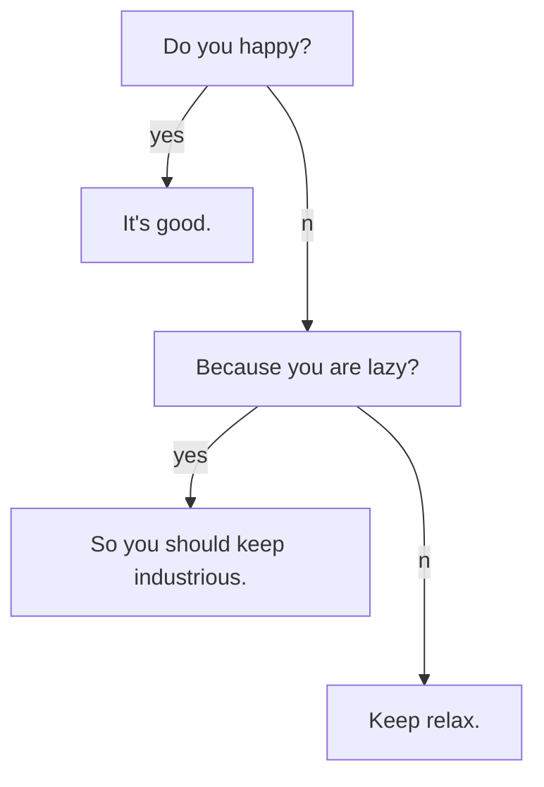

This is a success alert.
{:.success}

This is a info alert.
{:.info}

This is a warning alert.
{:.warning}

This is a error alert.
{:.error}

`This is a success tag.`{:.success}

`This is a info tag.`{:.info}

`This is a warning tag.`{:.warning}

`This is a error tag.`{:.error}



```chart
{
  "type": "polarArea",
  "data": {
    "datasets": [
      {
        "data": [
          11,
          16,
          7,
          3,
          14
        ],
        "backgroundColor": [
          "#FF6384",
          "#4BC0C0",
          "#FFCE56",
          "#E7E9ED",
          "#36A2EB"
        ],
        "label": "My dataset"
      }
    ],
    "labels": [
      "Red",
      "Green",
      "Yellow",
      "Grey",
      "Blue"
    ]
  },
  "options": {}
}
```

